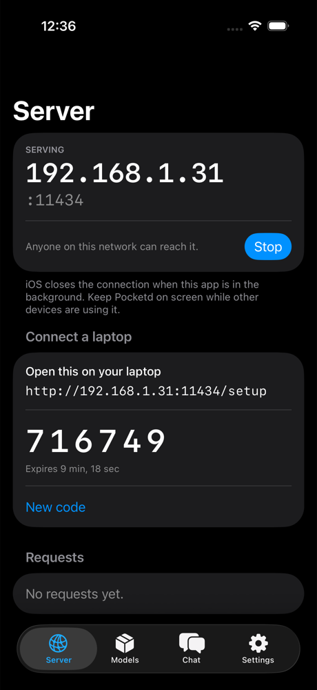
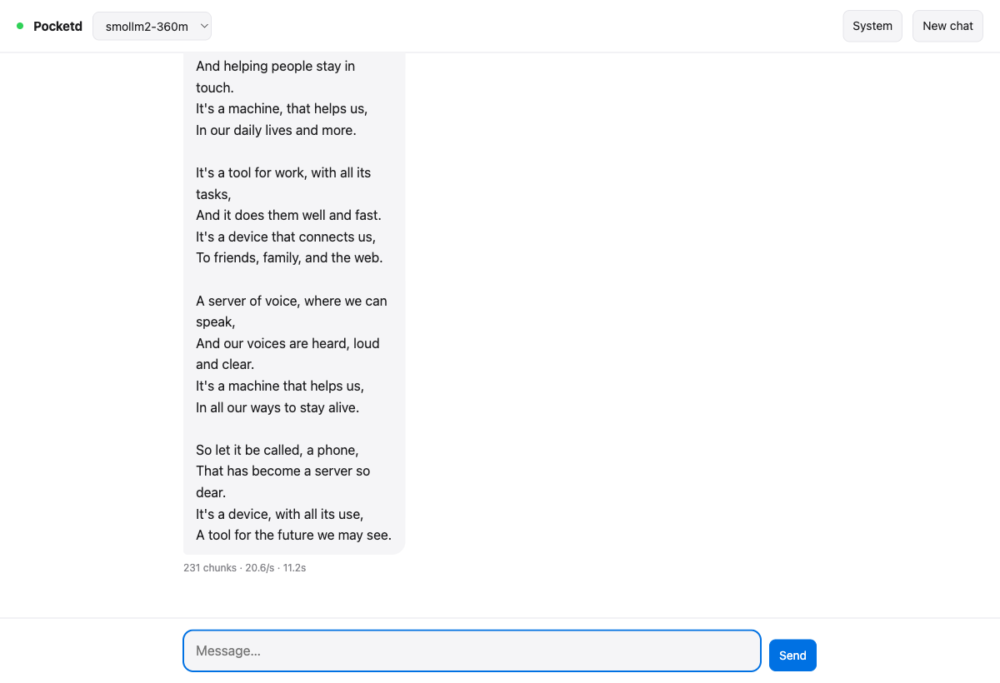
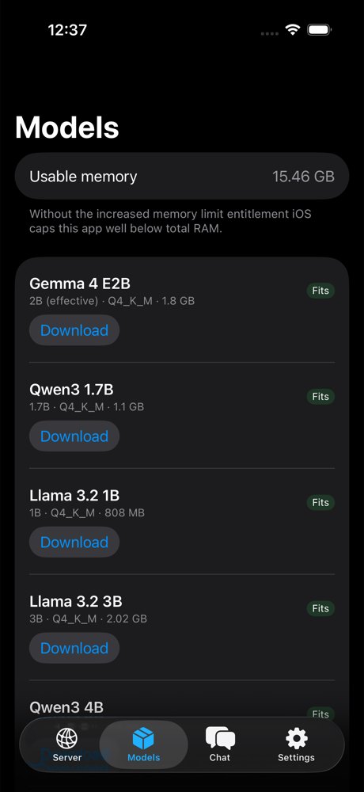

# pocketd

[](https://github.com/dheerajjha/pocketd/actions/workflows/ci.yml)
[](LICENSE)
[](Package.swift)
[](project.yml)

`pocketd` turns an iPhone into an inference server. Load a model, press Start,
and every device on your Wi-Fi can talk to it through the OpenAI and Ollama
APIs they already speak — no account, no cloud, nothing leaving the network.

```bash
curl http://192.168.1.42:11434/v1/chat/completions \
  -H "Content-Type: application/json" \
  -H "Authorization: Bearer pk-…" \
  -d '{"model":"gemma-4-e2b","messages":[{"role":"user","content":"hello"}]}'
```

That is a phone answering. The port is Ollama's default on purpose: a client
already pointed at a desktop Ollama needs its host changed and nothing else.



## Chat from your laptop, with nothing installed

The phone already runs a web server, so it serves the client too. Open its
address in a browser and you get a chat window — streaming, model picker,
system prompt, stop button, history kept locally, tokens per second per reply.
No Docker, no account, no extension.



The page asks once for the six digits shown on the phone and remembers the key.
`/setup` has the same handshake and hands back ready-to-paste configs for curl,
Continue, opencode, the OpenAI SDKs, Open WebUI and Aider.

## Why this exists

Every local-LLM app for iOS is a chat window. The model is right there, running
on hardware you own, and it can only be reached by the app that loaded it. The
most-requested feature on the leading open-source iOS client has been an HTTP
endpoint since [2024](https://github.com/a-ghorbani/pocketpal-ai/issues/203) and
is still open. The App Store option that does expose one is built on Apple
Intelligence, so it needs an iPhone 15 Pro or newer and refuses to run on
anything older.

`pocketd` is the other approach: llama.cpp, GGUF weights, and a real HTTP
server, on any device that can run iOS 18.

## Install

Requires Xcode 26 and [XcodeGen](https://github.com/yonaskolb/XcodeGen)
(`brew install xcodegen`). The `.xcodeproj` is generated, not committed.

```bash
git clone https://github.com/dheerajjha/pocketd
cd pocketd
make app          # generates Pocketd.xcodeproj
open Pocketd.xcodeproj
```

Set your team in Signing & Capabilities, then run on a device. A free Apple
developer account works; the provisioning profile expires after seven days and
you re-sign.

## What you can point at it

| Client | Works via | Configuration |
| --- | --- | --- |
| `curl`, `httpie` | OpenAI | Base URL + bearer token |
| OpenAI Python/JS SDK | OpenAI | `base_url="http://<phone>:11434/v1"` |
| Open WebUI | Ollama | Add an Ollama connection |
| Continue, Cline, Aider | OpenAI | Custom provider, any model id from `/v1/models` |
| LangChain, LlamaIndex | OpenAI | `ChatOpenAI(base_url=…)` |
| Anything Ollama-shaped | Ollama | Change the host, keep the port |

## API

| Endpoint | Dialect | Notes |
| --- | --- | --- |
| `GET /v1/models` | OpenAI | Installed models, not the whole catalogue |
| `POST /v1/chat/completions` | OpenAI | `stream: true` yields SSE, terminated by `[DONE]` |
| `POST /v1/completions` | OpenAI | Lifted into a single user turn |
| `GET /api/tags` | Ollama | |
| `POST /api/chat` | Ollama | Streams NDJSON, and streams **by default** |
| `POST /api/generate` | Ollama | |
| `POST /api/show` | Ollama | |
| `GET /api/version` | Ollama | Clients version-gate on this |
| `GET /health` | — | Unauthenticated, so a client can probe reachability |

Requests are authenticated with `Authorization: Bearer <key>` or `X-API-Key`.
Errors come back in the dialect you asked in: OpenAI's nested `{"error":{…}}`
or Ollama's flat `{"error":"…"}`, because a client fed the wrong one reports
"unknown error" and hides the reason.



## Which models actually fit

An iPhone 14 has 6 GB of RAM and iOS lets one app touch roughly 45% of it —
about 58% with the `com.apple.developer.kernel.increased-memory-limit`
entitlement this app ships. The Models tab labels every model against that
budget and makes you confirm a download that will not fit, with the two numbers
on screen, rather than letting you find out after 2 GB of bandwidth.

| Model | Q4 size | iPhone 14 (6 GB) | iPhone 16 Pro (8 GB) |
| --- | --- | --- | --- |
| SmolLM2 360M | 0.4 GB | Fits | Fits |
| Llama 3.2 1B | 0.8 GB | Fits | Fits |
| Qwen3 1.7B | 1.1 GB | Fits | Fits |
| Gemma 4 E2B | 1.8 GB | Fits | Fits |
| Llama 3.2 3B | 2.0 GB | Tight | Fits |
| Qwen3 4B | 2.5 GB | Needs the entitlement | Fits |

Expect roughly 15–25 tok/s for the 2B class on an A15, dropping to single
digits at 3–4B. The `128K` context Gemma 4 advertises is real for the weights
and not for the device: the KV cache is what exhausts a phone, so the server
caps context separately and defaults to 4096.

## What iOS makes hard

These are not bugs, and pretending otherwise would waste your afternoon.

- **A backgrounded app is an offline server.** iOS closes the listening socket
  when the app suspends. `pocketd` re-establishes it on every foreground and
  keeps the screen awake while serving, but the phone has to stay on Pocketd.
- **Thermals.** Sustained generation on a phone throttles within minutes. Fine
  for bursts, poor as an always-on endpoint.
- **Local Network permission** is requested on first start. Deny it and the
  socket accepts nothing from other devices, silently.
- **DHCP moves the address.** Use a router reservation, or read the URL off the
  Server tab each time.
- **Sampling is bound at load time.** llama.cpp fixes temperature, top-k and
  top-p to the context, so per-request overrides are ignored; `max_tokens` and
  `stop` are enforced by the server itself. Set sampling in Settings.
- **Token counts are estimates.** `usage` is derived from a 4-characters-per-token
  approximation, not the model's tokenizer. Do not bill anyone against it.
- **Oversized prompts are refused, not truncated.** llama.cpp does not fail
  gracefully on a prompt past its batch — it raises an assertion and the process
  dies. So the server refuses with a 413 before the engine sees it, using a
  deliberately pessimistic estimate. A prompt near the limit may be refused
  even though it would have fit.
- **One generation at a time.** A phone has one GPU. A second concurrent request
  gets a 503 with `Retry-After` rather than being queued behind the first.

## Verified

Run end to end on a physical **iPhone 14** (iOS 26.5) and on an iPhone 17
simulator, with real SmolLM2 360M weights and real llama.cpp:

- **29.4 tok/s** on the iPhone 14 with Metal — 200 tokens in 6.8s. The same
  build on the simulator, which is CPU-only, manages 5.6.
- `opencode` configured against the phone answers a prompt end to end
- the browser chat client streams at 20.6 chunks/s

- 386 MB downloaded in under 20 seconds, loaded, served
- reachable from the host Mac at the phone's LAN address
- `scripts/smoke.sh`: 38/38, including a 600-token buffered completion, a
  concurrent request correctly refused, an abandoned stream releasing its slot,
  and a 20,000-word prompt refused with a 413 instead of killing the process
- request log reporting live throughput per client

Three of those checks exist because the feature was broken and shipping when it
was written. The package suite is 70 tests and needs no simulator.

## Repository layout

```
Sources/PocketdKit/      the server, the wire formats, the model store
  Inference/             InferenceEngine protocol — the seam
  Models/                catalogue, downloads, device memory budget
  Server/                lifecycle, routes, SSE and NDJSON streaming
Tests/PocketdKitTests/   70 tests, no simulator, no GPU
scripts/smoke.sh         probes a RUNNING server the way a client would
App/Sources/             the SwiftUI app
  Inference/             llama.cpp adapter (LocalLLMClient)
project.yml              XcodeGen spec; the .xcodeproj is generated
```

`PocketdKit` depends on an HTTP server and nothing else. The inference backend
enters through one protocol, which is why the entire API surface — routes, auth,
streaming, error shapes — is tested on a Linux-or-macOS runner in about a second
without compiling llama.cpp or booting a simulator. Swapping in MLX or Apple's
Foundation Models means writing one conformance, not touching the routes.

## Development

```bash
make test        # the package: fast, no simulator
make app         # regenerate the Xcode project
make build-sim   # compile the app target (slow: builds llama.cpp)
make smoke BASE=http://192.168.1.42:11434 KEY=pk-...   # probe a running server
```

`make test` covers the routes against a mock engine. `make smoke` covers what it
cannot: a real model, a real device, and a real network hop. Read the base URL
and key off the app's Server tab.

The simulator runs llama.cpp on the CPU. It is the right place to check that
things compile and the UI behaves, and useless for measuring tokens per second.

### Where the compatibility rules come from

`reference/sync.sh` shallow-clones the projects this one reads: Ollama and
llama.cpp for the two wire formats, and PocketPal, LLMFarm and fullmoon for the
iOS problems. The folder is git-ignored — they are other people's repositories
under their own licenses, read here and never vendored.

Almost every compatibility rule in this repository came from one of those
sources rather than a guess, and the tests say which:

| Rule | Source |
| --- | --- |
| `HEAD /`, `HEAD /api/tags`, `HEAD /api/version` | `ollama/server/routes.go` |
| `parent_model` and `families` always on the wire | `ollama/api/types.go` — no `omitempty` |
| Usage chunk carries an empty `choices` array | `llama.cpp/tools/server/server-task.cpp` |
| `NSAllowsLocalNetworking` in the app's ATS block | `pocketpal-ai/ios/PocketPal/Info.plist` |
| Warn on an oversized model instead of blocking | PocketPal's memory-warning dialog |
| Ship `increased-memory-limit` | all three iOS apps do |

## Contributing

By roughly how long it takes:

1. **A model in the catalogue** (~5 minutes) — add a `ModelRecord` to
   `ModelCatalog.swift` with a real size in bytes. The size is what the fit
   badge is computed from, so an estimate that is wrong by a gigabyte is worse
   than no entry.
2. **A client compatibility fix** (~30 minutes) — if a client refuses to talk
   to `pocketd`, the fix belongs in `Routes+OpenAI.swift` or `Routes+Ollama.swift`
   with a test that captures the exact shape the client wanted.
3. **A new backend** (~half a day) — conform to `InferenceEngine`. MLX and
   Foundation Models are both reachable through LocalLLMClient already.

Every route change needs a test that goes over real HTTP. `TestServer` boots a
listener on a kernel-assigned port; calling handlers directly would pass while
the SSE framing and the status codes were wrong, which is exactly the layer
third-party clients depend on.

## License

MIT. See [LICENSE](LICENSE).
